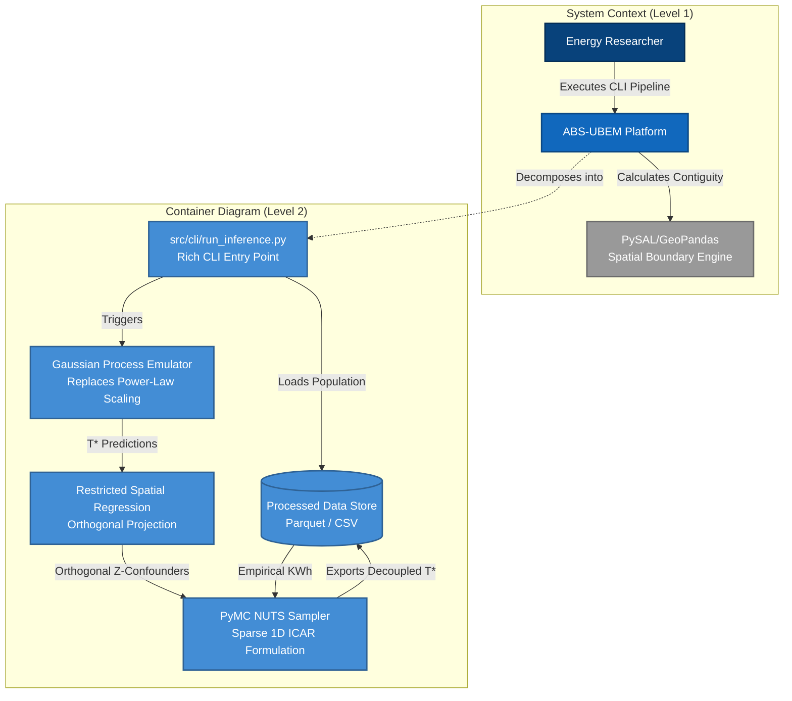

# ABS-UBEM: Agent-Based Spatial Urban Building Energy Model

A highly-scalable, methodologically rigorous Bayesian inference pipeline for decoupling physical building efficiency from socioeconomic energy rationing (fuel poverty).

## Execution (Out-of-the-Box)
To run the fully reproducible Bayesian pipeline:

```bash
# Execute the beautiful Rich CLI interface
python -m src.cli.run_inference
```

## System Architecture (C4 Model)
This repository is structured according to strict SOLID principles and the Gentzkow & Shapiro guidelines for reproducibility. Below is the C4 architecture mapping the flow of data through the Bayesian components.




