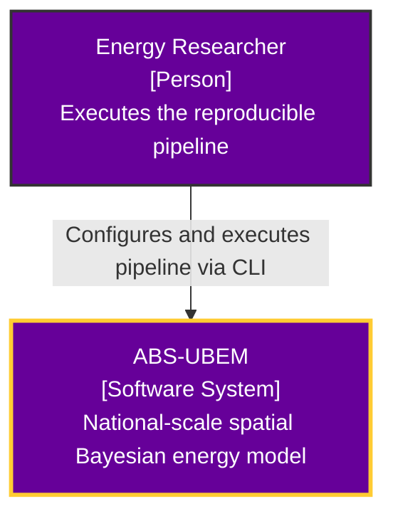
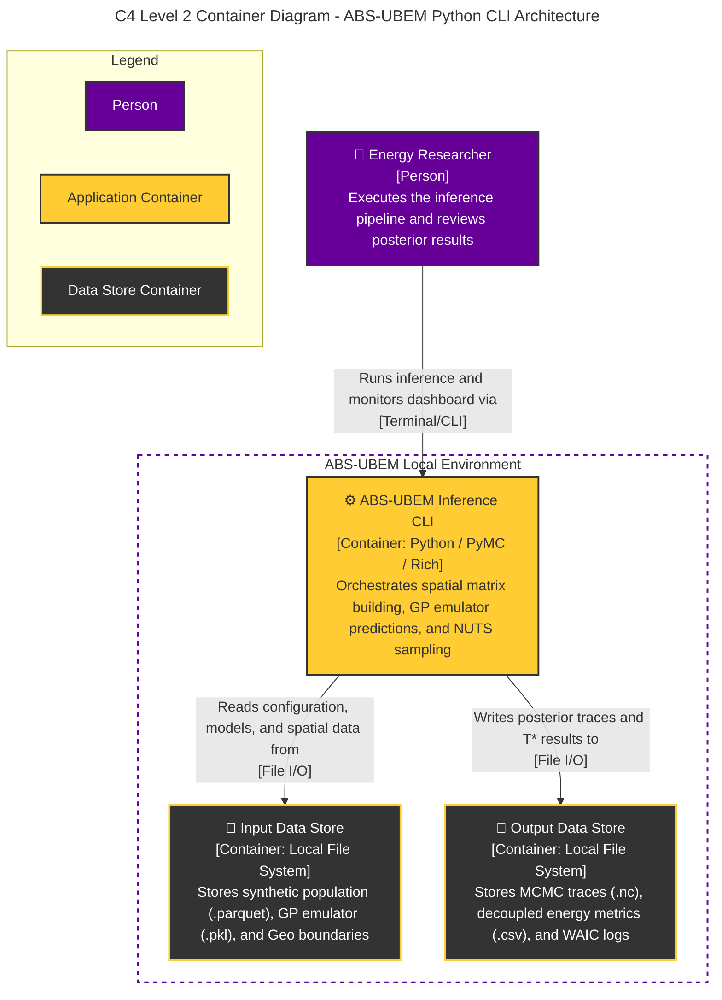
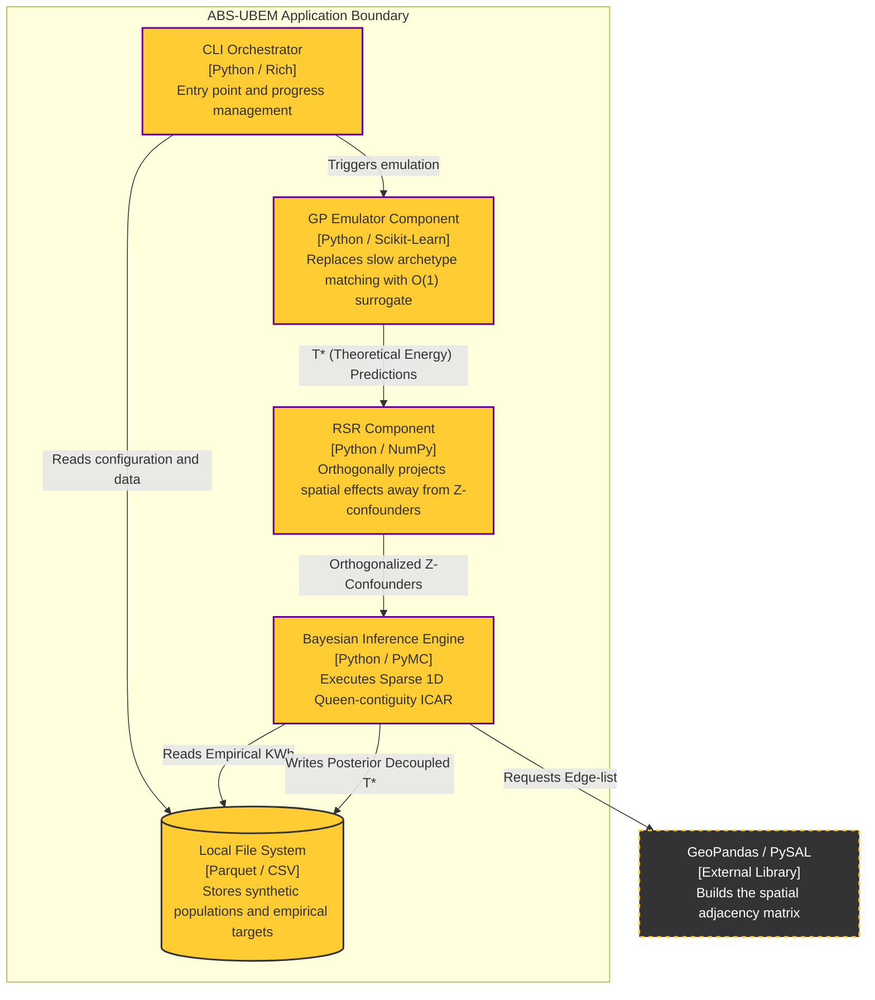

# ABS-UBEM: Agent-Based Spatial Urban Building Energy Model

A highly-scalable, methodologically rigorous Bayesian inference pipeline for decoupling physical building efficiency from socioeconomic energy rationing (fuel poverty).

## Execution (Out-of-the-Box)
To run the fully reproducible Bayesian pipeline:

```bash
# Execute the beautiful Rich CLI interface
python -m src.cli.run_inference
```

## System Architecture (C4 Model)
### Level 1: System Context Diagram
A high-level view showing the user interaction with the ABS-UBEM software boundary.



### Level 2: Container Diagram
Zooming into the ABS-UBEM software system to show its primary execution containers.



### Level 3: Component Diagram (ABS-UBEM Application)
Zooming inside the application runtime to show the Python logic modules handling the physics-to-spatial pipeline.



**C4 Legend:**
*   **Purple (`#660099`)**: Primary Actors and Core Systems.
*   **Gold/Yellow (`#FFCC33`)**: Internal Components and Local Storage.
*   **Dark Grey (`#333333`)**: External Third-Party Library Dependencies.


